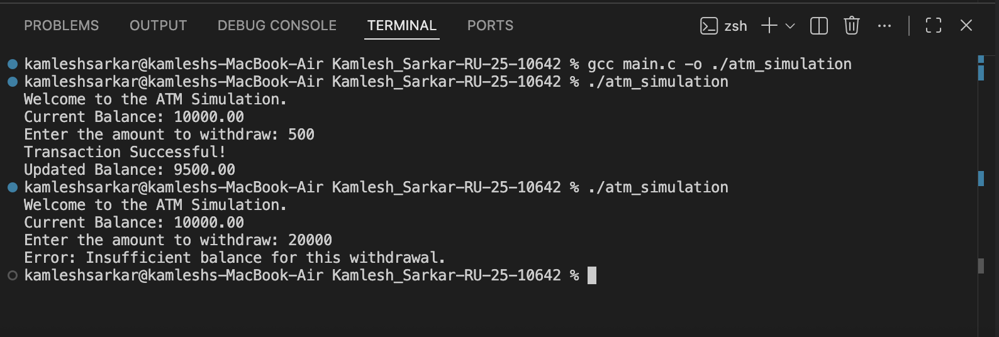

# ATM Withdrawal Simulation 🏧

### Project Details
- **Student Name:** Kamlesh Sarkar
- **ERP ID:** RU-25-10642
- **Project Number:** P2
- **Language Used:** C

---

## 📌 Why this Project? (Project Purpose)
This project was created to simulate the core logic of a real-world ATM machine. The main objective is to understand how financial transactions are processed programmatically, specifically focusing on:
- Handling user inputs securely.
- Validating transactions (checking if the balance is sufficient).
- Updating financial records in real-time.

It demonstrates the practical application of **conditional statements (if-else)** and **arithmetic operations** in C to solve real-life problems.

---

## 🛠 Utility & Features
This program serves as a basic banking module that can:
1. **Check Validity:** Ensures the user cannot withdraw a negative amount or zero.
2. **Balance Check:** Verifies if the account has enough funds before processing the transaction.
3. **Transaction Processing:** Instantly deducts the withdrawal amount from the main balance.
4. **User Feedback:** Provides clear messages for success, insufficient funds, or invalid inputs.

---

## 🚀 Future Scope
While this is a simulation, it can be expanded into a full-fledged banking system by adding:
- **PIN Authentication:** Adding a security layer before access.
- **Deposit Feature:** Allowing users to add money to their balance.
- **File Handling:** Saving transaction history to a file permanently.
- **Multiple Users:** Using structures to manage different bank accounts.

---

## 💻 Output Screenshot
Here is the simulation of a successful withdrawal:

